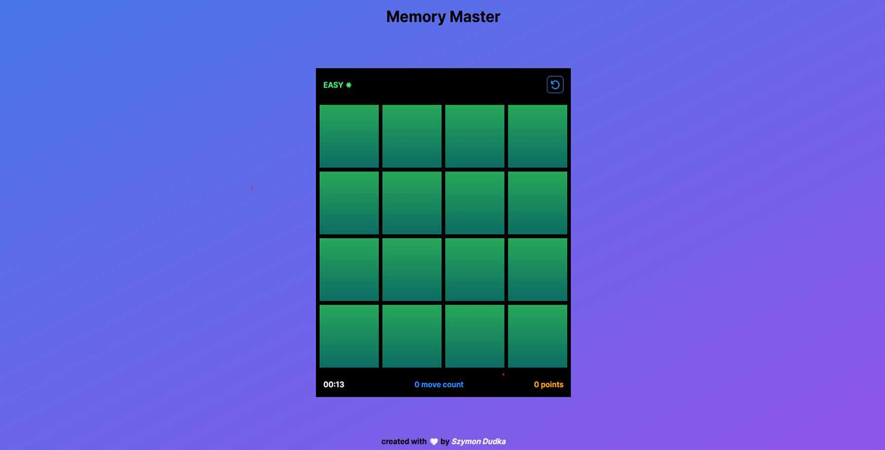

# Memory Master



The game where you have to match all the images to win. Created with TypeScript and DOM manipulation.

https://memory-master-sd.vercel.app

## Main technologies


## Details

- created with JavaScript and TypeScript
- DOM manipulation
- grid layout
- styling with SASS
- CSS animations

## Tutorial and project structure

Inside the project you'll see the following folders and files:

```
PROJECT_ROOT        # main files
└── assets          # icons and images
```

Download the repository to your local machine and run to download all missing dependencies:

```
yarn install
```

After that you can run this project with:

```
yarn dev
```

To build your application use:

```
yarn build
```
