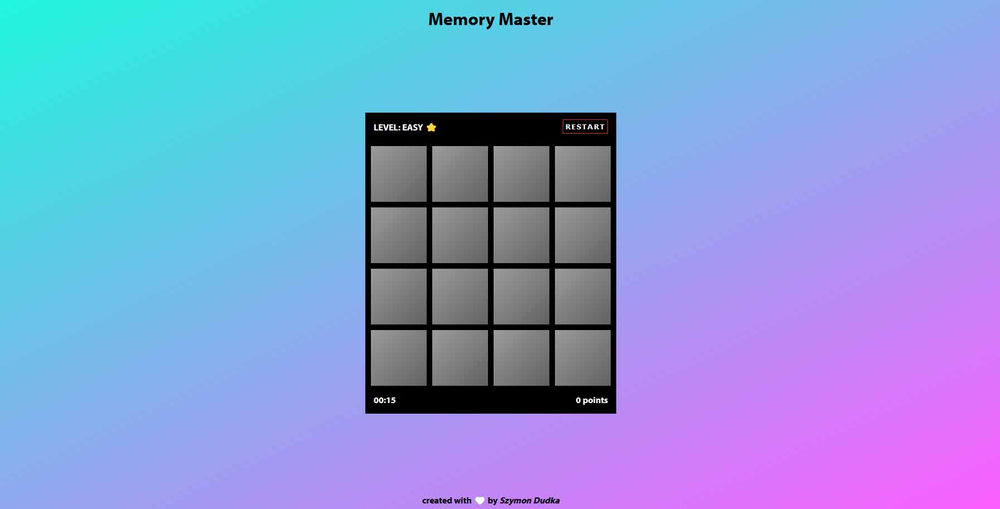

# Memory Master


Memory Master is a game where you have to match all images to win.

https://memory-master-sd.vercel.app/

## Main technologies


## Details
- simple game build with vanilla JavaScript
- flex layout
- DOM manipulation
- CSS animations

## Tutorial and project structure
Inside of project, you'll see the following folders and files:

```
PROJECT_ROOT        # index files
├── assets          # images
└── styles          # styles files
```

You can download the repository to your local machine and run with **Live Server** extension on your local machine.